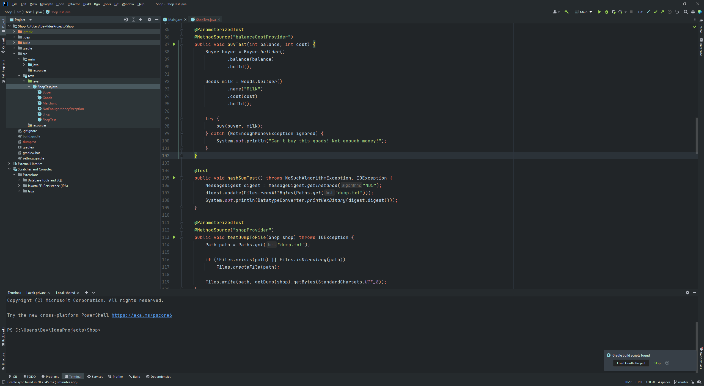
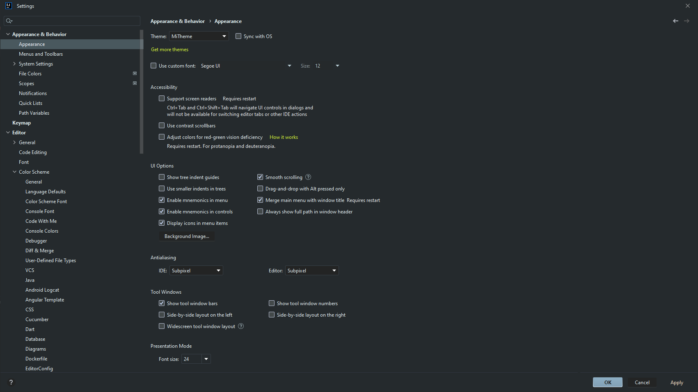

# IntelliJ MiTheme

The **MiTheme** is a dark theme with a slight blue-turquoise tint **for** the **IntelliJ IDE**.

This theme was designed on the Windows 10 operating system, but it is perfect for other systems.

## Installation

The plugin can be installed from the JetBrains marketplace:
https://plugins.jetbrains.com/plugin/19153-mitheme

## Screenshots

**Code**:

**Settings**:

## License

[MIT](LICENSE)
